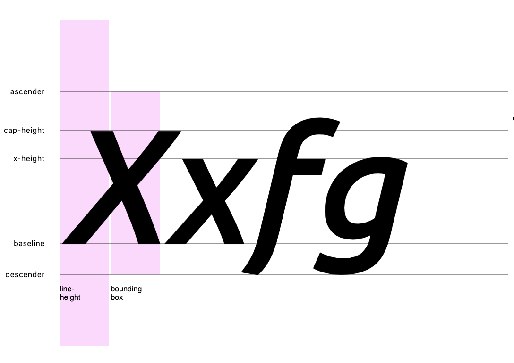

# Tailwind Compositor

Compositor is essentially a system of constraints, that helps implement aesthetically pleasing, predictable typographic compositions, based on objective, rational, constant dimensions of space.

> It is not important that the result should be this or that. What is important, is that the form should and must take it's shape, in obedience to an order or formula. It is in the design of the formula and not in the design of the form, that the creative pleasure resides. And thus the aim of the creative work
> _Karl Gerstner - Designing Programmes_

---

---

## Motivation

Traditionally, in typography, space between lines of text is measured from the baseline. The browsers behave differently and center vertically, the bounding box, or the distance from the ascender to the descender, to the line-height.

As a result, when rendering text, the browser adds white-space above and below each line and block of text, unline any other dom element. So regardless of margin/padding, depending on the order of UI components, font, font-size and line-height the space between two elements, will be out the intended rhythm by `(ascent + abs(descent)) - lineHeight / 2`.

[Vertical Metrics Visualization](https://vertical-metrics.netlify.app)


#### High Fault Tolerance

The second problem regarding web typography in most design systems, is that most systems only provide a series of independent token collections, family, size, weight, style, line-height, letter-spacing that can be applied interchangeably. The vast majority of these combinations don't produce useful results, or even worse don't exist at all.

For example, when a browser can't find the true bold or italic version of a font, because for example, we don't load this particular style, it will often create faux bold and italics by stretching and slanting the glyphs which renders the information uninteligible.

---

## Solution

The compositor attempts to solve these problems using font metrics to crop the white space around text, with a modified [basekick](https://github.com/michaeltaranto/basekick) recipe. Also implements a baseline grid system that allows us to anchor layout elements to a meaningful rhythm,

---

---

## Installation

You will need postcss, tailwindcss and fontkit installed along with the plugin

##### dependencies

```
npm install postcss fontkit tailwindcss tailwind-compositor
```

##### postcss.config.js

In your `postcss.config.js` you will need to import your standard `tailwind.config.js`, but also your `compositor.config.js`.

The `{ compositor }` will receive both, merge with your tailwind config **spacing scale is overwriten**, and return a standard tailwind configuration.

```
const tailwindcss = require('tailwindcss');]
const { compositor } = require('tailwind-compositor');

// import both configurations
const compositorConfig = require('./compositor.config.js');
const tailwindConfig = require('./tailwind.config.js');

// compose config
const tailwindConfigComposed = compositor(compositorConfig)(tailwindConfig);

// use with tailwind
module.exports = {
  plugins: [
    tailwindcss(tailwindConfigComposed),
  ],
};
```

---

---

## Configuration

##### compositor.config.js

```
const compositorConfig = {
  // useRem
  useRem: true,

  // root (html) font-size in px units
  root: 16,

  // baseline grid in px units
  baseline: 8,

  // type scale in px units
  type: [16, 18, 20, 22, 24, 28, 30, 32, 40, 48, 56, 60, 72],

  // rhythm in baseline units
  rhythm: [0, 1, 2, 3, 4, 5, 6, 8, 10, 12],

  // measure in ch units
  measure: [10, 15, 20, 30, 35, 50, 55, 60, 65],

  // webfonts and vertical metrics
  fonts: [
    {
      key: "sans-400",
      familyName: "Inter",
      fallback: "sans-serif",
      weight: 400,
      italic: false,
      upm: 2816,
      xHeight: 1536,
      capHeight: 2048,
      ascent: 2728,
      descent: -680
    }
    {
      key: 'sans-600',
      familyName: "Inter",
      fallback: 'sans-serif',
      file: path.resolve('./fonts/inter/Inter-Semibold.woff2'),
    },
  ],

  // compositor options
  options: {
    xray: true,
    baseline: true,
    capheight: true,
    xheight: true,
    rhythm: true,
    measure: true,
  },
}
```

#### - `useRem: bool`

When useRem is set to true, all spacing and font-size utilities, will be transformed to `rem` units. Otherwise remain as configured, in `px`. It is recommended to always favour `rem` units, however it's more efficient to communicate values, for example with designers using `px` units. With `useRem` you can switch all the values with a single configuration.

#### -`root: integer`

The root font size `1rem` in `px` units.

#### - `baseline: integer`

The baseline grid row height, in `px` units.

#### - `type : array[integer]`

```
type: [16, 18, 20, 22, 24, 28, 30, 32, 40, 48, 56, 60, 72]
```

The system's typographic scale, in `px` units, specified as an array of integers. If `useRem` is `true` when font-size is applied, it will be translated to `rem` units.

#### - `rhythm : array[integer]`

```
rhythm: [0, 1, 2, 3, 4, 5, 6, 8, 10, 12]
```

The system's size and spacing scale, in `baseline` units, specified as an array of integers, If `useRem` is `true` when margin, padding, height, grid-gap is applied it will be translated to `rem` units.

#### - `measure : array[integer]`

```
measure: [10, 15, 20, 30, 35, 50, 55, 60, 65]
```

Separate scale used for line-width utilities, in `ch` units.

#### - `fonts array[opentype]`

The font scale provides all the information needed to render text styles. Each entry describes a font/weight/style set, and only those that are part of the system will be enabled.

The `key` property is used for the utility classes. The configuration bellow will produce two font styles `sans-400` which will render Inter Regular and `sans-400i` it's italics style respectively.

You can preconfigure each font style manually, or use the `file` property to reference any font format, and extract the vertical metrics dynamically.

```
{
  key: "sans-400",
  familyName: "Inter",
  fallback: "sans-serif",
  weight: 400,
  italic: false,
  upm: 2816,
  xHeight: 1536,
  capHeight: 2048,
  ascent: 2728,
  descent: -680
}
{
  key: 'sans-400i',
  familyName: "Inter",
  fallback: 'sans-serif',
  file: path.resolve('./fonts/inter/Inter-Italic.woff2'),
},
```

#### - `options`

enable config can be used to enable/disable individual compositor utilities. Unlike tailwind, compositor's utilities are only responsive.

**baseline** Enable baseline typographic utilities
**capheight** Enable capheight typographic utilities
**xheight** Enable xheight typographic utilities
**rhythm** Enable rhythm utilities
**measure** Enable measure utilities
**xray** Enable xray utilities

---

### Utilities

#### Typographic Utilities

```
<p class="font-sans-400 type-3/2 measure-8">
  Amet et non nisi ex
</p>
```

-   `font-{font-key} // font style`
-   `type-{typeScale}/{leading} // baseline bbox`
-   `capheight-{typeScale}/{leading} // cap-height bbox`
-   `xheight-{typeScale}/{leading} // x-height bbox`
    `

```
// family / style
<p class="font-sans-400" />
<p class="font-sans-400i" />

// bounding box / type scale / leading
<div class="font-sans-400 type-10/3" />
<div class="font-sans-400 capheight-5/3" />
<div class="font-sans-400 xheight-5/3" />
```

---

#### Measure Utility

-   `measure-{measure_scale_index}`

```
<p class="measure-0">Ad proident quis enim duis commodo.</p>
<p class="measure-1">Ad proident quis enim duis commodo.</p>
<p class="measure-2">Ad proident quis enim duis commodo.</p>
<p class="measure-3">Ad proident quis enim duis commodo.</p>
```

---

#### Rhythm Utility

-   `rhythm-{rhythm_scale_index}`
-   `rhythm-y-{rhythm_scale_index}`
-   `rhythm-x-{rhythm_scale_index}`

```
<section class="rhythm-3 lg:rhythm-5" />
  <h3 class="sans400 type-7/3" />
  <p class="sans400 type-5/3" />

  // render horizontally
  <div class="flex flex-row rhythm-x-2" >
    <button />
    <button />
  </div>
</section>
```

---

#### Size and Spacing

When the tailwind theme is composed, the rhythm scale is transformed to tailwindcss spacing scale and can be used thereafter for all spacing utilities, margin, padding and grid-gap.

By default compositor will use the same scale to extend the other tailwind sizing scales, width, min/max width and height min/max.

```
<section class="p-4">
  <h3 class="sans400 type-7/3 mb-4" />
  <input type="text" class="h-8 mb-4" />
  <button class="h-8 mb-px" />
  <p class="sans400i type-1/2" />
</section>

```

---

#### XRay

```
<section class="bg-baseline" />
```

---

---

### Can i use it?

1. You can definitely use it as an educational or prototyping tool.

2. Depending on your typescale and number of webfonts, the output can be way beyond anything you should consider shipping, in terms of file size. **You must use purgecss with this library.** For many use cases, personal blogs, minimal aesthetic, it should be fine.

3. Currently, the system should only work with horizontal layouts, but at this moment, it's hasn't been tested thoroughly with non-latin characters. So if you're going to try it, please share your observations.

4. It really depends on your font. Some fonts are poorly designed (some very popular too) and don't render identically across browsers and operating systems. The error might be negligible in reading size, but display text can be problematic.

---
